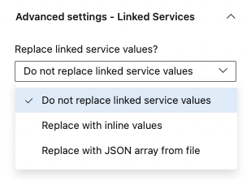

# <span style="color:darkcyan">Advanced deployment</span>

## <span style="color:darkcyan">Replace values in Linked Service definitions</span>
It is highly recommended to use Key Vault secrets for all parameters in Linked Services, which changes between environments.\
Even the ones that doesn't have UI support, like the User Name and Base URL on the REST Linked Service, using the method described here:\
<a href="https://medium.com/@damoo/use-key-vault-secrets-in-any-azure-data-factory-connection-property-943ca0d8f26f" target="_blank">Use Key Vault Secrets in any Azure Data Factory connection property</a>.\
\

If you for some reason cannot do this, or for any other reason need to modify a Linked Service before deploying it to an environment, this feature is for you.\
You can choose to provide the values inline (max 200 chars) or thru a file in your artifact:\
\

Regardless if you use the inline or file approach, the supplied value must be a valid json array with the changes you want to make.\
 \
As an example, if you wanted to change the User Name and Base URL in the linked service on the screen shot above, your array should look like this:
``` json
[
    {
        "name": "RestService1",
        "properties": {
            "typeProperties": {
                "url": "https://TheNewURLToUSe.com",
                "userName": "TheCorrectUserName",
            }
        }
    }
]
```
You should only include the properties that you want to have changed.

## <span style="color:darkcyan">Map names of Key Vault Linked Services</span>
If you only have one Key Vault linked service in each environment, then it doesn't matter if there are differences in the name between environments.\
Like KeyVaultDev, KeyVaultTest & KeyVaultProd (but why would you)\
The task will automatically detect the name of the Key Vault Linked Service and make the appropriate mapping.\
If you have more than one, and they have the same name in all environments, then no mapping is needed.\
In the rare case where you have multiple Key Vault Linked Services in each environment AND they are not named the same in each environment, you'll need to provide a mapping table, so the taks knows that the LS called KeyVaultConfig in your repo files, is actually called ConfigTest in the test environment (as an example)\
You can provide this inline or thru a file.\

\
It should be a valid json array, with a single property in each object mapping the name in the repo to the name in the environment, like this:
``` json
[
    {
        "LSNameInRepo": "LSNameInEnvironment"
    }
]
```

## <span style="color:darkcyan">Replace values in Trigger definitions</span>
Like with Linked Service definitions, you can modify a triggers for a specific environment\
These changes can also be supplied either inline or thru a file:\
\
If you have a trigger defined like this in your repo:\
\
but in one environment wanted to change the schedule time to 05:00, you could do it like this:
``` json
[
    {
        "name": "Run everything nightly",
        "properties": {
            "typeProperties": {
                "recurrence": {
                    "schedule": {
                        "minutes": [
                            0
                        ],
                        "hours": [
                            5
                        ]
                    }
                }
            }
        }
    }
]
```
and in another environment, you don't even want this trigger to run:
``` json
[
    {
        "name": "Run everything nightly",
        "properties": {
            "runtimeState": "Stopped",
        }
    }
]
```
Please note, that you should only provide the properties with changes.

## <span style="color:darkcyan">Replace SHIR names</span>
Just like with Key Vault Linked Services, you can provide a mapping table for the name of Integration Runtimes.\
It is only needed if you have MORE than one SHIR, and they are NOT named the same in the environments:\
\
You can again provide the mapping inline or thru a file, and the format is similar to when mapping KeyVault LS's:
``` json
[
    {
        "SHIRNameInRepo": "SHIRNameInEnvironment"
    }
]
```