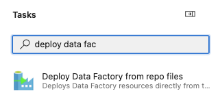
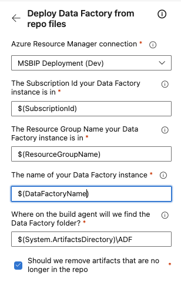

# Deployment of Data Factory resources

## Add deployment task
First you need to add the task to your pipeline.\
Search for `deploy data factory` to quickly get to it:\
\

## Basic setup of the deployment task
Now you need to configure it:\
\
| Setting             | Description                                                                              |
|:--------------------|:-----------------------------------------------------------------------------------------|
| ARM Connection      | A service connection with at least contributor role on the Data Factory instance         |
| Subscription Id     | The id of the subscription where your ADF is (preferably from a variable)                |
| Resource Group Name | Name of the Resource Group, where your ADF is. (preferably from a variable)              |
| ADF Name            | The name of the ADF resource                                                             |
| Data Factory Folder | If you publish your ADF files as an artifact called ADF, then the default should be fine |
| Remove artifacts    | Should the task cleanup no longer relevant resources?                                    |