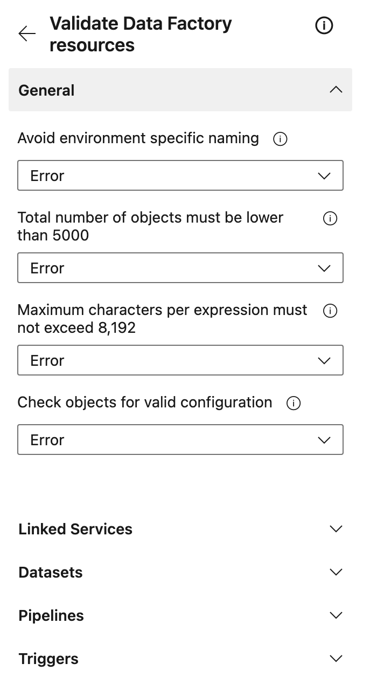

# Validating Data Factory resources

This task has not yet been released, but it is scheduled to be released before end of year 2022.\
It will contain a lot of checks (19 and counting) which can be run against a pull request to ensure
the quality of your Data Factory resources, before merging into your collaboration branch.\
